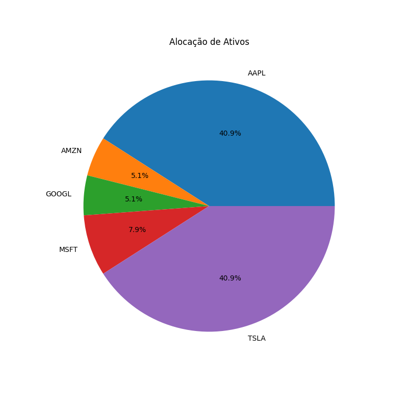
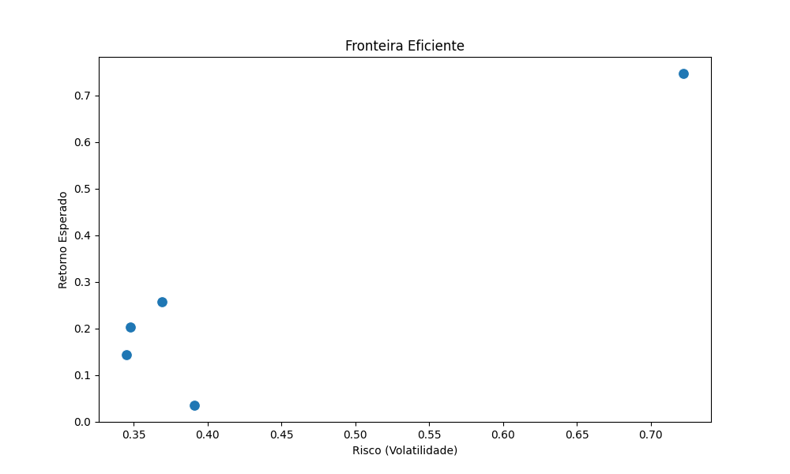

## Davi Ricardo Lima Correia
## Matricula: 2022200550
## Turma: 962-94349 Otimização de Sistemas


# Modelagem Matemática

## Definições

Seja `n` o número de ativos disponíveis. Para cada ativo `i`, temos:

- `r_i`: Retorno esperado do ativo `i` (equivalente ao valor do item no problema da mochila).
- `v_i`: Risco do ativo `i` (equivalente ao peso do item no problema da mochila).
- `x_i`: Fração de alocação de capital no ativo `i`, onde `0 ≤ x_i ≤ 1` representa a proporção do portfólio investida nesse ativo.

## Função Objetivo

O objetivo é maximizar o retorno total da carteira, que é dado pela soma ponderada dos retornos esperados dos ativos escolhidos:

Maximizar: Z = Σ (r_i * x_i)

## Restrições

1. **Restrição de Capacidade (Risco Máximo):**
Σ (v_i * x_i) ≤ R
Onde `R` é o limite de risco tolerado.

2. **Restrição de Alocação:**
0 ≤ x_i ≤ 1 para todo i

## Interpretação das Restrições

- A primeira restrição assegura que a soma ponderada dos riscos dos ativos escolhidos não ultrapasse o limite de risco tolerado pelo investidor, `R`.
- A segunda restrição garante que a alocação em cada ativo permaneça dentro de limites razoáveis, ou seja, que a alocação total não exceda 100% do capital disponível.


# instalação

## requisitos

execute o seguinte comando no terminal para instalar os requisitos:
```
pip install pandas numpy scipy matplotlib yfinance seaborn
```
## execução
dentro da pasta APS execute esses comandos no terminal:
```
python3 coleta.py
python3 processamento.py
python3 otimizar.py
python3 visualizar.py
```
Resumo da Execução dos Arquivos

Coletar os dados financeiros: coleta.py

Processar os dados coletados: processamento.py

Otimizar a alocação dos ativos: otimizar.py

Visualizar os resultados: visualizar.py


# Explicação

## coleta.py
Este script coleta dados financeiros historicos de ativos utilizando a API do Yahoo Finance via `yfinance`. Ele calcula o retorno esperado e a volatilidade (risco) dos ativos com base nos preços históricos, salvando os dados no arquivo `ativos_metricas.csv`. neste caso estamos usando os ativos AAPL, MSFT, GOOGL, AMZN e TSLA entre 01/01/2021 a 01/01/2023 e salvando na planilha ativos_historico.csv dentro da pasta docs.


## processamento.py

O arquivo processamento.py é responsável por pegar os dados brutos dos preços históricos dos ativos na planilha ativos_historico.csv e transformá-los em métricas que serão usadas no algoritmo de otimização de carteira. Ele faz isso calculando o retorno esperado e o risco de cada ativo, e armazena essas informações de maneira organizada no arquivo ativos_metricas.csv para as próximas etapas.

## otimizar.py

O arquivo otimizar.py é responsável por realizar a otimização da alocação de ativos da carteira de investimentos. Ele utiliza um modelo de programação linear para encontrar a melhor combinação de ativos que maximiza o retorno esperado, enquanto respeita o limite de risco definido.

Principais Funções e Etapas:
Carregamento dos Dados:
Os dados de retorno esperado e risco dos ativos são carregados do arquivo ativos_metricas.csv, que foi gerado no passo anterior (processamento.py).

Definição de Parâmetros:
O parâmetro de risco (R) é definido como o limite máximo de risco que a carteira pode tolerar. Além disso, a função objetivo visa maximizar o retorno esperado, e as restrições de proporções de investimento são estabelecidas para garantir que cada ativo receba entre 0% e 100% de alocação.

Resolução do Problema:
Utilizando a função linprog da biblioteca SciPy, o problema de otimização é resolvido para determinar a melhor alocação de ativos.

Saída (Alocação de Ativos):
A solução gerada pelo algoritmo fornece a proporção de capital que deve ser investida em cada ativo. Essas proporções são salvas no arquivo ativos_alocacao.csv, que será utilizado posteriormente na visualização dos resultados.

## visualizar.py

O arquivo visualizar.py é responsável pela geração das visualizações gráficas que ajudam a analisar a alocação de ativos e as métricas de performance da carteira otimizada. As visualizações são essenciais para proporcionar uma compreensão visual clara dos resultados da otimização.

Principais Funções e Etapas:
Carregamento dos Dados:
Os dados de alocação de ativos, retornos esperados e riscos são carregados dos arquivos CSV gerados nas etapas anteriores.

Gráfico de Pizza (Distribuição de Ativos):
Um gráfico de pizza é gerado para mostrar como o capital foi alocado entre os diferentes ativos da carteira. Este gráfico destaca a concentração ou diversificação da carteira.


Gráfico de Dispersão (Risco vs. Retorno):
O gráfico de dispersão é usado para visualizar a relação entre o risco (volatilidade) e o retorno esperado de cada ativo. Isso permite que o investidor veja claramente quais ativos oferecem uma combinação mais favorável de risco e retorno.



